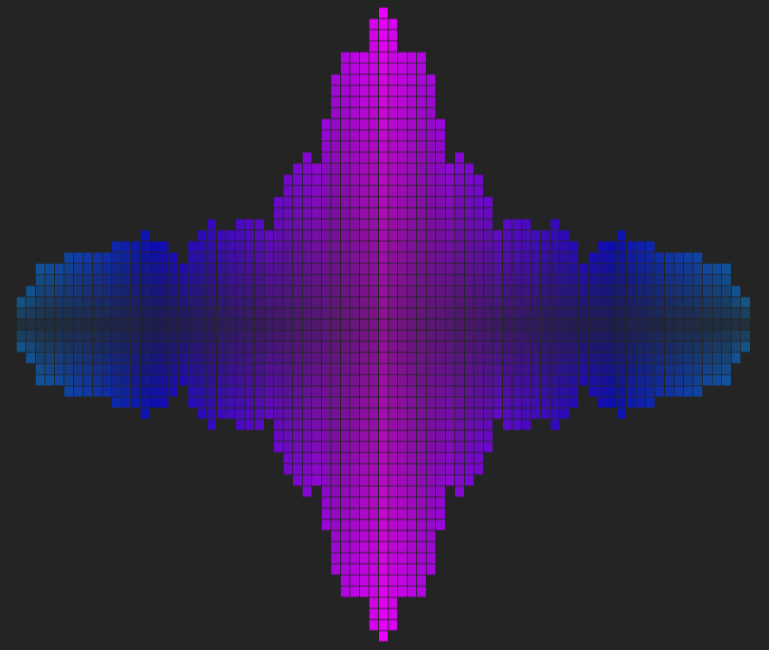

# MusicLights

MusicLights is an open source music visualization library written in Typescript for web browsers.

## Visualizers

Check the individual types within the files to understand the options available for each.

### CellBars

Adds symmetric bars filled with square cells. The hue of the color changes outwards.



## API

```
MusicLights(audioEl, canvasEl, options)
    .addVisualizer(CellBars(options));
```

> Note: The API is bound to change at any time, including the names and options available. Use at your own will.
